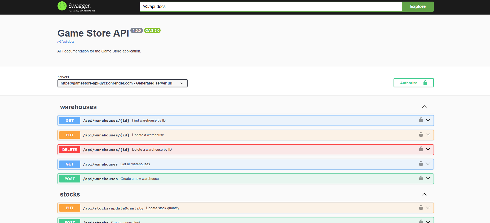
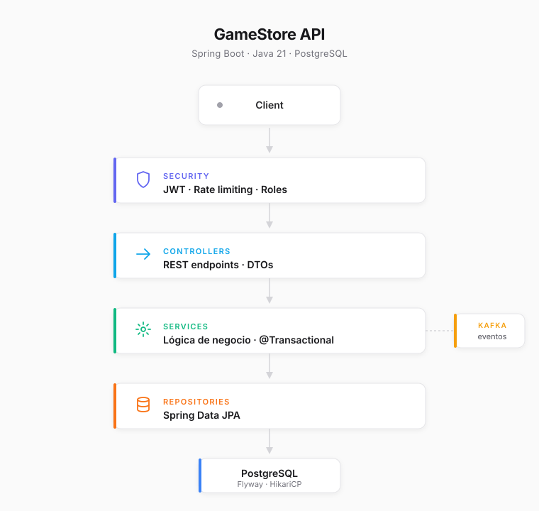
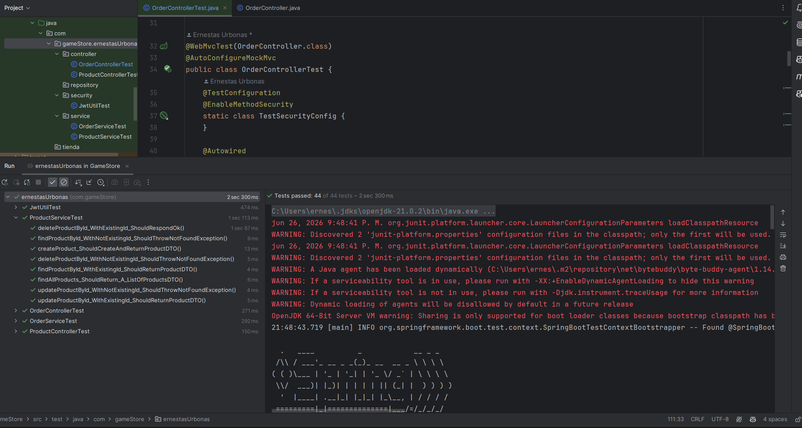

# 🎮 Video Game Store API


 
Backend REST API desarrollada como proyecto de portfolio personal, simulando el backend de una tienda online de videojuegos. El objetivo es mostrar cómo construyo APIs **claras, mantenibles y seguras** siguiendo buenas prácticas.
 
---
 
## 📌 Descripción
 
El proyecto está construido con Spring Boot y PostgreSQL, aplicando principios de arquitectura en capas y seguridad con JWT. Está pensado para ser **realista** y profesional, no un tutorial ni un ejercicio académico.
 
---

## 🔗 Demo en vivo

#### 🎨 Frontend Demo

[gamestore-ernestas.netlify.app](https://gamestore-ernestas.netlify.app/)

> Demo visual del frontend. Actualmente utiliza datos de ejemplo y no está conectado en tiempo real al backend.

---

#### ⚙️ Backend API (desplegada en Render)

https://gamestore-api-uycr.onrender.com

##### 📄 Swagger Documentation

https://gamestore-api-uycr.onrender.com/swagger-ui/index.html#/

> API REST desarrollada con Java + Spring Boot y desplegada en Render. Documentación interactiva disponible en Swagger.

---

## 🚀 Quick Start

1. Clona el repositorio
2. Copia `.env.example` a `.env` y rellena tus valores
3. Ejecuta `docker-compose up --build`
4. Accede a Swagger en `http://localhost:8080/swagger-ui/index.html`

---
 
## 🛠️ Stack tecnológico
 
- **Java 21 (LTS)**
- **Spring Boot 3.3.4**
- **Spring Security + JWT**
- **PostgreSQL**
- **Flyway** — migraciones de base de datos
- **Maven**
- **JUnit 5 + Mockito** — testing unitario
- **Swagger / OpenAPI** — documentación de endpoints
- **Apache Kafka** — mensajería de eventos asíncronos
- **Docker & Docker Compose** — containerización
- **Bucket4j** — rate limiting

---
 
## 🏗️ Arquitectura y diseño


 
Arquitectura en capas para separar responsabilidades:
 
- **Controllers** → Endpoints REST
- **Services** → Lógica de negocio
- **Repositories** → Persistencia de datos
- **Mappers** → Conversión entre entidades y DTOs
- **Security** → Autenticación y autorización con JWT
- **Kafka** → Eventos asíncronos (pedidos, stock, notificaciones)
- **Filter** → Rate limiting por IP
 
Se aplican principios **SOLID**, separation of concerns y uso de **DTOs** para no exponer entidades directamente.
 
---
 
## 🔐 Seguridad
 
- Registro y login de usuarios
- Tokens JWT con roles (`USER`, `ADMIN`) incluidos en el payload
- Filtro JWT personalizado con `OncePerRequestFilter`
- Protección de endpoints por autenticación
- Manejo global de excepciones con `@RestControllerAdvice`
- Refresh tokens con persistencia en base de datos
- Rate limiting por IP con Bucket4j (20 req/min)
- Autorización por roles con @PreAuthorize

---
 
## 📦 Modelo de dominio
 
- **User** → Usuarios registrados con roles
- **Product** → Videojuegos con categoría, condición y tags
- **Order** → Pedido realizado por un usuario
- **OrderItem** → Productos dentro de un pedido con precio y cantidad
- **Stock** → Inventario de productos por almacén
- **Warehouse** → Almacenes físicos
 
Relaciones modeladas de forma realista para e-commerce.
 
---
 
## 🗄️ Base de datos y migraciones
 
- Gestionada con **Flyway**, garantizando control de versiones de esquema
- Evita modificaciones manuales y facilita trabajo en equipo
- Compatible con PostgreSQL
 
---
 
## 📡 Endpoints principales
 
```http
POST   /auth/login
POST   /auth/refresh
POST   /api/users
 
GET    /api/products
GET    /api/products/{id}
POST   /api/products
PUT    /api/products
DELETE /api/products/{id}
 
POST   /api/orders
GET    /api/orders?userId={id}
PUT    /api/orders
PUT    /api/orders/update-status?orderId={id}&newOrderStatus={status}
 
GET    /api/stocks/search?warehouseId={id}&productId={id}
POST   /api/stocks
PUT    /api/stocks/updateQuantity
 
GET    /api/warehouses
GET    /api/warehouses/{id}
POST   /api/warehouses
PUT    /api/warehouses/{id}
DELETE /api/warehouses/{id}
```
 
La documentación completa está disponible en Swagger UI una vez arrancado el proyecto:
```
http://localhost:8080/swagger-ui/index.html
```
 
---
 
## 🧪 Testing



- **44 tests** con JUnit 5 y Mockito
- **32 tests unitarios** — `OrderService`, `ProductService`, `JwtUtil`
- **12 tests de integración** con MockMvc — `ProductController`, `OrderController`
- Casos positivos, negativos y de seguridad cubiertos
- Patrón AAA (Arrange, Act, Assert) aplicado consistentemente
 
---
 
## 🚀 Roadmap

- [x] Descuento de stock al crear pedidos
- [x] Máquina de estados para transiciones de pedidos
- [x] Autorización por roles con `@PreAuthorize`
- [x] Tests de integración con MockMvc
- [x] Integración con **Kafka** para eventos asíncronos (emails, notificaciones, stock)
- [x] Refresh tokens y rate limiting
- [x] Docker & Docker Compose para levantar el entorno fácilmente
 
---
 
## 👨‍💻 Autor
 
Desarrollado por **Ernestas Urbonas**
Backend Developer | Java & Spring Boot
 
- LinkedIn: [linkedin.com/in/ernestas-urbonas-020702220](https://www.linkedin.com/in/ernestas-urbonas-020702220)
